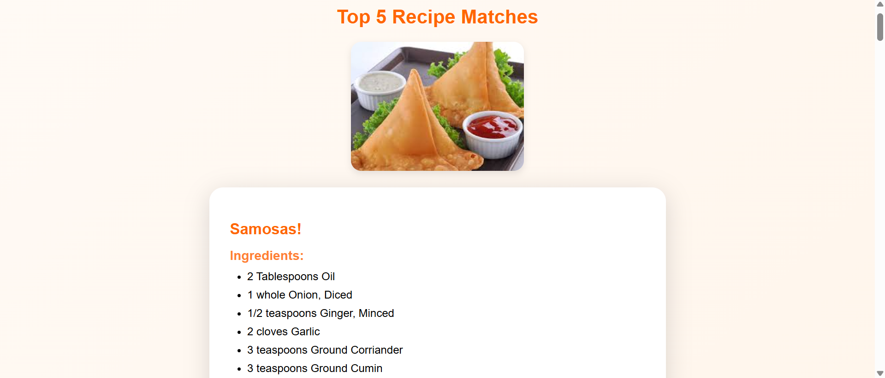
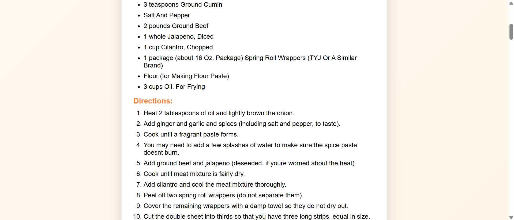
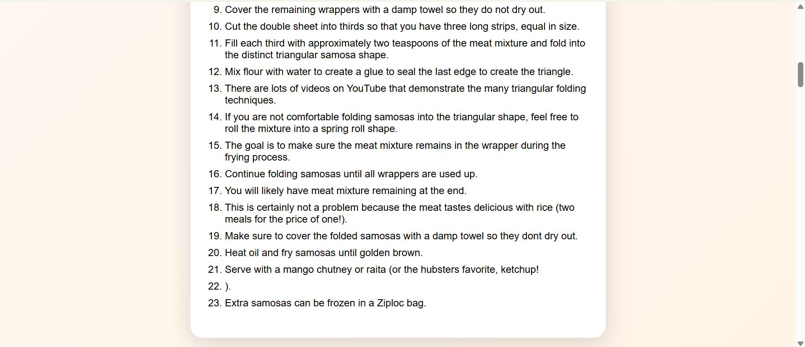

# Recipify: We help you find what you crave
Recipify is an AI-powered web application that identifies food from an image and recommends the top 5 matching recipes with ingredients and cooking steps.  
It combines computer vision and semantic search to bridge the gap between what you see and what you can cook.

---

## 🚀 Features
- 📷 Upload a food image and get the name of the dish automatically predicted  
- 🍲 Retrieve top 5 most relevant recipes from RecipeNLG using semantic similarity  
- 🧾 Displays ingredients and step-by-step directions in a clean, responsive UI 
- ⚡ Built using Flask, PyTorch, and Sentence Transformers

---

## 🛠️ Technologies Used

| Category          | Technology / Tool                   |
|------------------|------------------------------------|
| Backend          | Python, Flask                       |
| Frontend         | HTML, CSS, JavaScript               |
| Machine Learning | PyTorch, EfficientNet-B0, Sentence Transformers |
| Dataset          | Food-101, RecipeNLG                 |
| Others           | NumPy, Pandas, Pillow               |

---

## 🗂️ Dataset

- **Food-101:** Contains 101 food classes and ~101k images, used to train EfficientNet-B0 for image classification.  
- **RecipeNLG:** Contains recipe titles, ingredients, and directions. Sentence embeddings allow efficient semantic search for recipes based on predicted food.

---

## ⚙️ How It Works

1. User uploads a food image.  
2. EfficientNet-B0 predicts the most likely food category.  
3. System searches RecipeNLG for top 5 recipes using **keyword search** and **semantic similarity**.  
4. Ingredients and directions are displayed in a **step-by-step format**, making it easy for users to follow.

---

## 🛠️ Installation & Setup

1. **Clone the repository:**
```bash
git clone https://github.com/your-username/Recipify.git
cd Recipify
```

2. **Install Dependencies:**
```bash
pip install -r requirements.txt
```

3. **Prepare required files:**
- best_food101_efficientnetb0.pth: trained EfficientNet-B0 model
- meta/classes.txt: Food-101 class names
- RecipeNLG_dataset.csv: recipe dataset
- title_embeddings.npy: precomputed recipe embeddings

4. **Run the app:**
```bash
python app.py
```

5. **Open in browser:**
```bash
http://127.0.0.1:5000
```

---

## Demo Screenshots








---

## 👩‍💻 Author
Vishakha Routra — AI & Full Stack Developer
